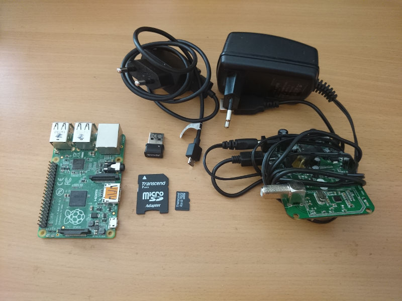
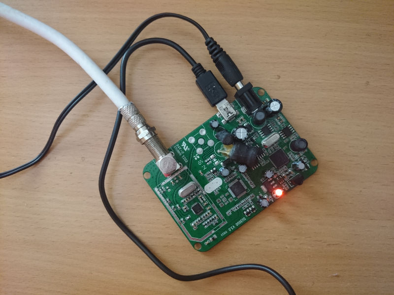
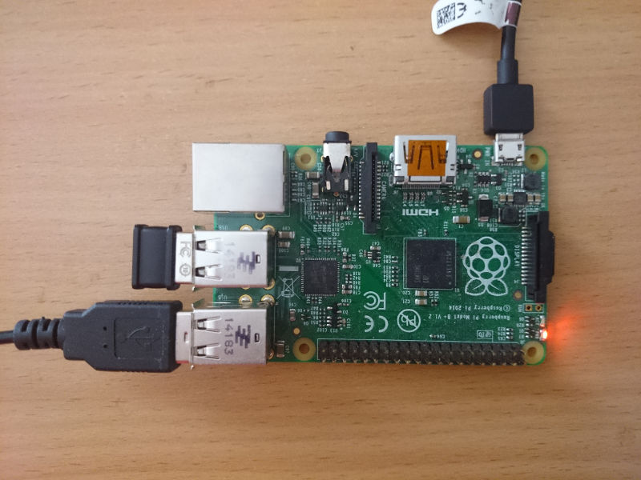

==============
Receiver HOWTO
==============

This document outlines the process of building the ORxPi receiver. No
familiarity with Linux is needed, but in some cases, familiarity with terminals
and command line is beneficial.

The instructions found here are applicable to the `Outernet DIY receiver kit`_.

.. contents::

Things you will need
====================

You will need:

- `Satellite dish`_ (80cm to 100cm depending on location)
- LNB_ (Universal is recommended, unless you are in a C-band area)
- Raspberry Pi model B or B+ (see `Known issues` below)
- USB DVB-S/S2 tuner with power supply (see `list of tuners`_)
- (optional) WiFi dongle (see `list of WiFi dongles`_)
- Power supply for Pi with 1A or more of output (you can also use a mobile
  phone charger)

For creating the bootable SD card, you will also need:

- microSD card (minimum size is 100MB, and the rest is used as storage)
- Computer (Windows, Linux, or Mac)
- SD card reader

For accessing the receiver over LAN (wired network), you will need:

- Router or wireless router with LAN ports
- LAN (cat5) cable

Creating the bootable SD card
=============================

If you have purchased the Outernet DIY receiver kit, you may skip this section,
and continue with `Assembling the receiver`_.

If you already have a bootable SD card, and you only wish to update it, please
refer to `Updating HOWTO`_.

To create the bootable SD card containing the ORxPi operating system, you need
to obtain the latest image (or create the image yourself, but that is outside
the scope of this document). The images are located on
`archive.outernet.is/images/`_, and latest image is always named
`ORxPi-latest.img.zip`_. Once the file is downloaded, unzip it.

Choosing the SD card
--------------------

You should be aware that not all cards work. While we haven't encountered any
issues with the card brands we are using, there have been reports of
non-working cards. Please refer to the `list on elinux.org`_ for more
information on different card brands people have tested.

Creating the SD card on Windows
-------------------------------

Insert the blank SD card into a SD card reader Install and start `Win32 Disk
Imager`_. This tool requires you to give it administrative privileges before it
can start.

Select the image file, and SD card drive using the drop-down. Click Write and
wait for it to complete the write.

Creating the SD card on Mac
---------------------------

Install and run `RPi-sd card builder`_ and follow the instructions on the page.

Creating the SD card on Linux
-----------------------------

First determine the device node for your SD card. In our example, we are
assuming the device node is ``/dev/sdb`` and that ORxPi version is 0.2.4. Edit 
the command below to match your situation. Use ``dd`` command to create the SD
card::

    dd if=/path/to/ORxPi-0.2.4.img of=/dev/sdb bs=1M

Assembling the receiver
=======================

We will use Geniatech HDStar tuner as example in the documentation. The steps
should apply to all tuners, but be sure to refer to the tuner's user manual.

Connect the coaxial cable coming from LNB to the tuner port as shown in the
image. Connect the tuner to the power supply. HDStar has a red LED that
indicates the tuner is powered. Connect the USB cable to the tuner (if cable is
separate).

Connect the tuner's USB cable to one of the free Raspberry Pi's USB port. If
you wish to use the wireless access point, connect the WiFi dongle to the USB
port. Insert the bootable SD card into the card slot on the back of the 
Raspberry Pi.

If you want to view the boot messages, you should also connect your monitor or
TV to the HDMI port on the side of your Raspberry Pi. In our example, we do not
use any displays.

If you wish to use the wired network connection, connect the Pi to your router
using the LAN cable. Note that direct connection between Pi and your computer
using a LAN cable (as with routers) is not supported.

As the last step, connect the power supply to the micro USB port.

Connecting to receiver's web interface
======================================

Receiver's main user interface is web based.

Accessing over WiFi access point
--------------------------------

When connecting to WiFi access point, the address at which you can find ORxPi's
web interface is `librarian.outernet`_. If this address does not work, try
`10.0.0.1`.

Accessing over LAN
------------------

To access over LAN, you need to find the receiver's IP address on the LAN.
Doing this is outside the scope of this document. We normally use Fing_.

Tuning in
=========

Please see the list of `Outernet transponders`_ for tuning and coverage 
information.

Further reading
===============

- `Adding content HOWTO`_
- `External storage HOWTO`_
- `Updating HOWTO`_

Known issues
============

On Raspberry Pi model B, PCTV 461e tuner cannot be used. We are working to
resolve this issue.

.. _Outernet DIY receiver kit: http://store.outernet.is/products/outernet-receiver-diy-kit-with-raspberry-pi
.. _Satellite dish: https://en.wikipedia.org/wiki/Satellite_dish
.. _LNB: https://en.wikipedia.org/wiki/Low-noise_block_downconverter
.. _list of tuners: ./tuners.rst
.. _list of WiFi dongles: ./wifi.rst
.. _archive.outernet.is/images/: http://archive.outernet.is/images/
.. _ORxPi-latest.img.zip: http://archive.outernet.is/images/ORxPi-latest.img.zip
.. _Win32 Disk Imager: http://sourceforge.net/projects/win32diskimager/
.. _RPi-sd card builder: https://alltheware.wordpress.com/2012/12/11/easiest-way-sd-card-setup/
.. _librarian.outernet: http://librarian.outernet/
.. _10.0.0.1: http://10.0.0.1/
.. _Fing: http://www.overlooksoft.com/download
.. _list on elinux.org: http://elinux.org/RPi_SD_cards#Working_.2F_Non-working_SD_cards
.. _Updating HOWTO: ./updating.rst
.. _Outernet transponders: ./transponders.rst
.. _Adding content HOWTO: ./adding_content.rst
.. _External storage HOWTO: ./external_storage.rst
